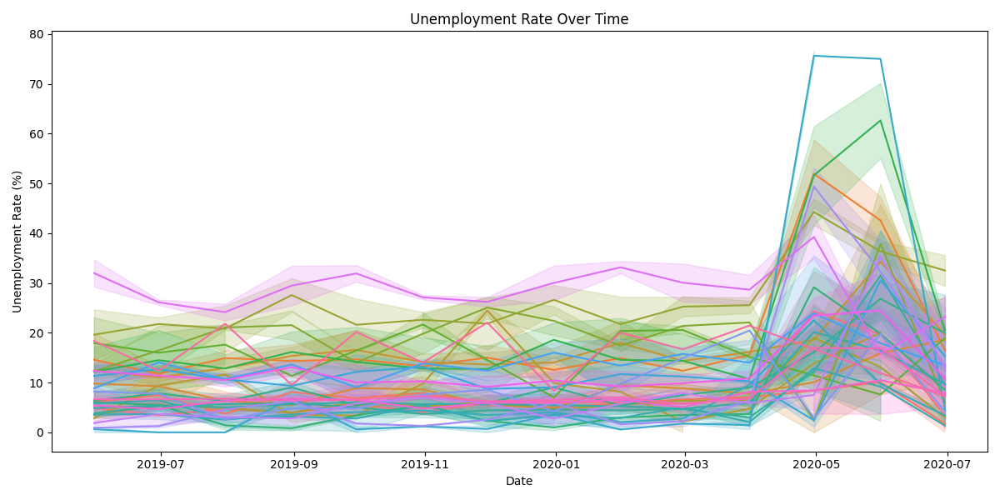
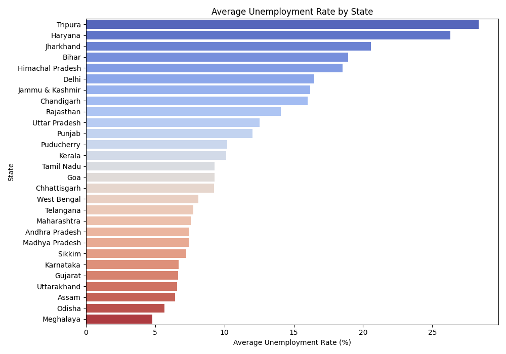
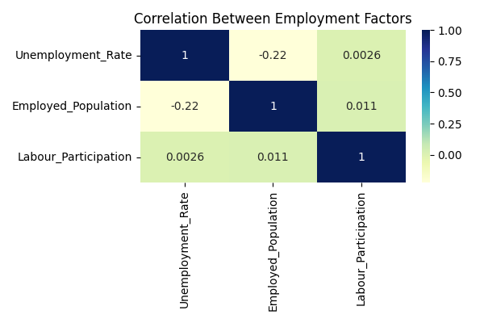

# 📊 Unemployment Analysis with Python
👨‍💻 Project by: Vommi Uma Mahesh

### 🧩 Task 2 - Oasis Infobyte Data Science Internship
**Intern Name:** Vommi Uma Mahesh  
**Internship Batch:** October–November 2025  
**Domain:** Data Science  

---

## 🧠 Project Overview
This project analyzes how **COVID-19 lockdowns impacted unemployment across India**.  
The dataset includes employment statistics for multiple states, and this analysis helps visualize trends, regional differences, and the overall economic impact of the pandemic.

---

## 📁 Dataset Details
**Dataset Name:** Unemployment in India.csv  
**Source:** [CMIE – Unemployment in India](https://unemploymentinindia.cmie.com/)  

| Column | Description |
|---------|--------------|
| `Region` | Name of the Indian state |
| `Date` | Date of observation (Monthly frequency) |
| `Frequency` | Data collection frequency |
| `Estimated Unemployment Rate (%)` | % of unemployed individuals |
| `Estimated Employed` | Estimated number of employed people |
| `Estimated Labour Participation Rate (%)` | Percentage of people active in the labor market |
| `Area` | Urban/Rural classification |

---

## ⚙️ Technologies Used
- Python  
- Pandas  
- Matplotlib  
- Seaborn  
- Plotly  

---

## 🚀 Steps Performed

### 1️⃣ Data Loading and Cleaning
- Imported CSV file using pandas  
- Removed unwanted spaces from column names  
- Converted date column into datetime format  
- Handled missing and duplicate values  
- Renamed columns for better readability  

### 2️⃣ Data Exploration
- Checked basic information (`head()`, `info()`, `describe()`)  
- Found number of unique states and value ranges  

### 3️⃣ Visualizations
Generated the following plots:

#### 📈 Unemployment Trend Over Time
Shows how unemployment fluctuated during lockdown months.  


#### 🗺️ Average Unemployment Rate by State
Compares average unemployment percentage across different states.  


#### 🔥 Correlation Heatmap
Displays relationships between employment, unemployment, and labor participation.  


#### 🌐 Interactive Map (HTML)
An animated choropleth map shows how unemployment changed across India month by month.  
File: `unemployment_map.html`

---

## 💡 Insights

- **Highest Unemployment:** 76.74% in *Puducherry (April 2020)*  
- **Lowest Unemployment:** 0.00% in *Assam (June 2020)*  
- Unemployment peaked during the **COVID-19 lockdown** period (mid-2020).  
- Gradual recovery is seen as restrictions were lifted.

---

## 🧮 How to Run the Project
1. Clone or download this repository.  
2. Ensure Python 3 is installed.  
3. Install dependencies:
   ```bash
   pip install pandas matplotlib seaborn plotly
   
## Run the Python script:

python unemployment_analysis.py


Check the generated visualizations and interactive map in the project folder.

## 🏁 Conclusion

This project provides insights into how the COVID-19 pandemic affected employment in India using data-driven visualizations.
It demonstrates the use of Python for real-world data analysis, including data cleaning, visualization, and interpretation.

## 🧾 Acknowledgment

This project is part of the AICTE Oasis Infobyte Data Science Internship Program (OIBSIP).
A big thanks to the Oasis Infobyte team for giving me this practical learning opportunity and helping me gain hands-on experience in Machine Learning.

⭐ If you liked this project, please give it a star on GitHub!


